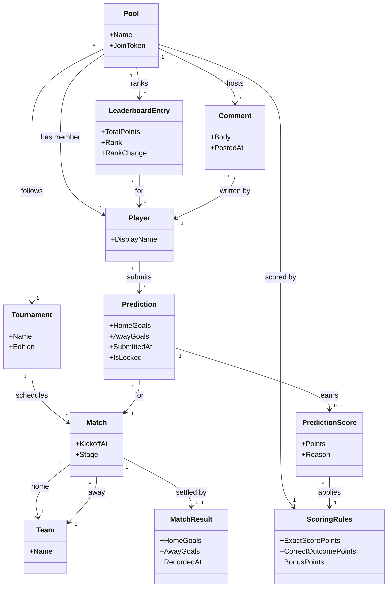

# Domain Model

The single source of truth for EKProno's domain vocabulary. Every spec that introduces or
changes an entity, a relationship, or a term updates this file — including the diagram below.

Derived from [docs/product/story-map.md](product/story-map.md). Stories are referenced as
`#NNN`.

## Diagram

## Entities

| Entity | Meaning | Stories |
| --- | --- | --- |
| **Tournament** | The football competition a pool follows, with its schedule of matches across group stage and knockouts. | #001, #002 |
| **Team** | A national team or club taking part in the tournament; appears as home or away side in a match. | #002 |
| **Match** | A single fixture: two teams, a kickoff moment, and a tournament stage. Kickoff is what locks predictions. | #002, #007 |
| **MatchResult** | The final score of a match, entered by the organiser. Recording it triggers scoring. | #008 |
| **Pool** | A prediction pool for one tournament, owned by an organiser and joined by players through a shareable link. | #001, #004 |
| **ScoringRules** | The pool's point configuration: points for an exact score, for the correct outcome, and any bonus points. | #003 |
| **Player** | A participant in a pool, identified by their display name. The organiser is the player who created the pool. | #005 |
| **Prediction** | A player's predicted score for one match. Locks automatically at kickoff and cannot change afterwards. | #006, #007 |
| **PredictionScore** | The points a prediction earned once its match was settled, with the reason (exact score, correct outcome, bonus) behind the breakdown. | #008, #009 |
| **LeaderboardEntry** | A player's standing in a pool: total points, current rank, and movement since the previous round. | #011, #012, #014 |
| **Comment** | A message a player posts in the pool's feed. | #013 |

## Vocabulary

- **Organiser** — the player who created the pool; the only one who may load the schedule,
  set the scoring rules, and enter match results (#001–#003, #008).
- **Round** — the set of matches grouped together for recap and reminder purposes
  (#010, #011, #014). Derived from the tournament schedule rather than stored separately.
- **Lock** — the moment a prediction becomes immutable, i.e. its match's kickoff (#007).
- **Settled** — a match that has a recorded result, and whose predictions therefore have
  scores (#008).
