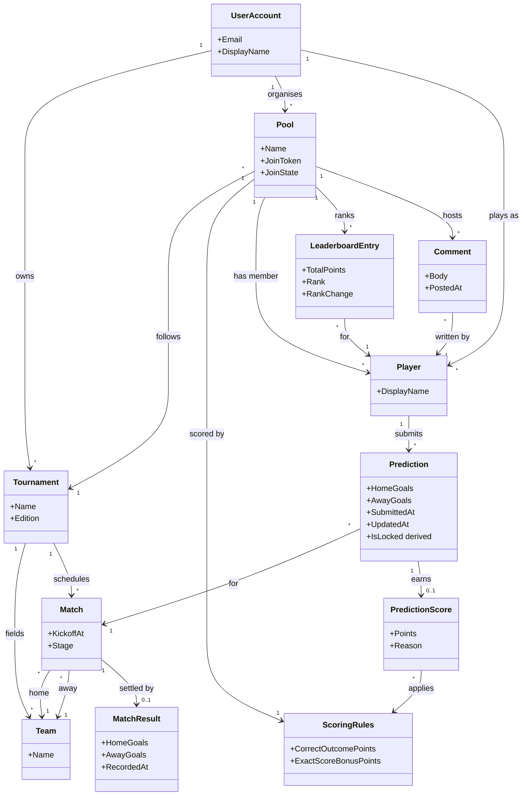

# Domain Model

The single source of truth for EKProno's domain vocabulary. Every spec that introduces or
changes an entity, a relationship, or a term updates this file — including the diagram below.

Derived from [docs/product/story-map.md](product/story-map.md). Stories are referenced as
`#NNN`.

## Diagram

## Entities

| Entity | Meaning | Stories |
| --- | --- | --- |
| **UserAccount** | The login identity behind an organiser or a player. One account may organise several pools and play in several more. | #001, #005 |
| **Tournament** | The football competition a pool follows, with its teams and its schedule of matches across group stage and knockouts. Entered by hand and owned by the organiser who entered it — there is no shared tournament catalogue. | #001, #002 |
| **Team** | A national team or club taking part in one tournament; appears as home or away side in a match. Scoped to its tournament, not shared. | #002 |
| **Match** | A single fixture: two teams, a kickoff moment, and a tournament stage. Kickoff is what locks predictions. Knockout fixtures are added once their teams are known; there are no placeholder sides. | #002, #007 |
| **MatchResult** | The final score of a match, entered by the organiser. Recording it triggers scoring. | #008 |
| **Pool** | A prediction pool for one tournament, owned by an organiser and joined by players through a shareable link. Its tournament is fixed at creation; its join link can be closed, reopened and rotated, and closes itself once the pool has started. | #001, #004 |
| **ScoringRules** | The pool's point configuration. Scoring is additive: `CorrectOutcomePoints` for calling the win/draw/loss right, plus `ExactScoreBonusPoints` on top for nailing the score. The outcome points are the organiser's to choose; the exact-score bonus is fixed at 1. | #003 |
| **Player** | A participant in a pool, identified by their display name within that pool and backed by a user account. Display names are unique within a pool and free across pools; an account is a player at most once per pool. The organiser is the player who created the pool. | #004, #005 |
| **Prediction** | A player's predicted final scoreline for one match, at most one per player per match. Editable until its match's kickoff and immutable from that instant, when it also becomes visible to the rest of the pool. `IsLocked` is derived from the match's kickoff, never stored. | #006, #007 |
| **PredictionScore** | The points a prediction earned once its match was settled, with the reason (exact score, correct outcome, no points) behind the breakdown. | #008, #009 |
| **LeaderboardEntry** | A player's standing in a pool: total points, current rank, and movement since the previous round. | #011, #012, #014 |
| **Comment** | A message a player posts in the pool's feed. | #013 |

## Vocabulary

- **Organiser** — the player who created the pool; the only one who may load the schedule,
  set the scoring rules, and enter match results (#001–#003, #008).
- **Round** — the set of matches grouped together for recap and reminder purposes
  (#010, #011, #014). Derived from the tournament schedule rather than stored separately.
- **Join link** — the absolute URL carrying a pool's secret `JoinToken`. One live link per
  pool; holding it is the only authorisation needed to join (#004, #005).
- **Rotation** — replacing a pool's join token, which kills the previous link immediately and
  permanently without touching anyone who already joined (#004).
- **Lock** — the moment a prediction becomes immutable, i.e. its match's kickoff. Derived
  from the match's kickoff against the server clock, per match, with no grace period and no
  override (#007).
- **Revealed** — a locked match whose predictions are visible to every player of the pool.
  Revelation happens at the lock and is irreversible (#007).
- **Scoreline** — a pair of goal counts, 0..99 each, used both for a prediction and for a
  match result so the two compare directly (#006, #008).
- **Outstanding** — an upcoming match a player has not predicted. Distinct from a predicted
  0-0: a missing prediction scores nothing rather than scoring as a draw (#006, #010).
- **Settled** — a match that has a recorded result, and whose predictions therefore have
  scores (#008).
- **Outcome** — the win/draw/loss shape of a scoreline, ignoring the goal counts. Calling it
  right is what earns `CorrectOutcomePoints` (#003).
- **Exact score** — a prediction whose goal counts both match the result. Always implies a
  correct outcome, so it is worth `CorrectOutcomePoints + ExactScoreBonusPoints` (#003).
- **Started** — a pool whose earliest match kickoff is in the past. A pool's scoring rules
  are frozen from that moment (#003).

## Specs

| Spec | Covers |
| --- | --- |
| [001 — Create a pool](specs/001-create-pool.md) | UserAccount, Pool, Tournament, Player |
| [002 — Enter the match schedule](specs/002-enter-match-schedule.md) | Team, Match, Stage |
| [003 — Choose the scoring rules](specs/003-scoring-rules.md) | ScoringRules, Outcome, PointsAward |
| [004 — Invite with a join link](specs/004-invite-with-join-link.md) | Pool join state, JoinToken, JoinLink |
| [005 — Join a pool](specs/005-join-pool.md) | Player, DisplayName |
| [006 — Enter score predictions](specs/006-enter-predictions.md) | Prediction, Scoreline |
| [007 — Predictions lock at kickoff](specs/007-prediction-lock.md) | LockState, LockRejection |
